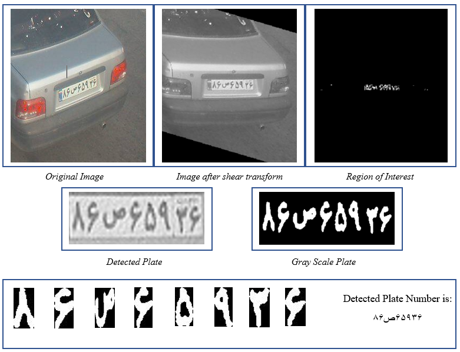

# Persian_License_Plate_Recognition

In this project an attmpt is made to detect and recognize car license plates in persian language. First of all we must extract the characters and numbers in the license plate. To do that the following steps were taken: 
1)Vertical edge detection
2)Histogram analysis
3)Vertical and Horizontal Dilation
4)Finding Regions in Common
5)Horizontal Dilation
6)Erosion
7)Post processing
After Extracting the character and numbers, we must train a Neural network that classsify character and number images. We can build a model based on CNN and Dense layers.
## Results of different steps of the algorithm

